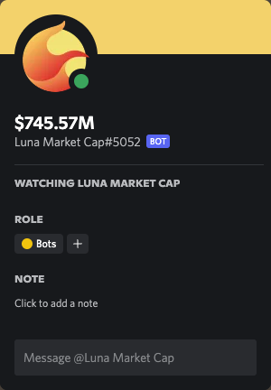

# Crypto Market Cap Watch Bot

## Introduction
A bot added to a Discord server to watch for the market cap of the configured coin.




## Usage
Copy the `.env.example` file to `.env`. Following is an example of how the `.env` file should look like

For now, the only supported `CURRENCY` is USD. We will add more options at a later date. 

```shell
COINMARKETCAP_API_BASE_URL=https://pro-api.coinmarketcap.com
COINMARKETCAP_API_TOKEN=<COINMARKETCAP API KEY>
COIN_ID=terra-luna
CURRENCY=USD
DISCORD_BOT_API_TOKEN=<DISCORD BOT TOKEN>
```

## Adding the bot
The bot is available to add via the following:

[Add bot to Discord server](https://discord.com/api/oauth2/authorize?client_id=980054028807438377&permissions=0&scope=bot)

As usual, you are recommended to verify the link before proceeding.

## Acknowledgement
- [CoinMarketCap](https://coinmarketcap.com)
